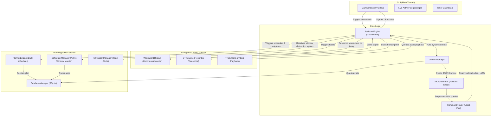

# FocusBuddy AI 🚀

FocusBuddy AI is a universal, personal, offline-first, voice-based focus, productivity, study-planning, and reminder assistant. Designed as a support-driven Windows desktop application, it acts as a proactive companion to keep you focused on your work, follow a daily study schedule, calculate exam countdowns, and recover gracefully when you get distracted or stuck.

---

## Architecture Diagram

The diagram below details FocusBuddy's multi-threaded PySide6 architecture, coordinating background audio processing, window monitoring, database updates, and fallback AI routing:



---

## Major Conversational Upgrades

1. **Intelligent Background Coordinator (`AssistantEngine`):** Orchestrates a 12-state internal machine. Runs a background tick loop every 1 second to execute alarms, verify tasks, and record active logs.
2. **Proactive Timed Alerts:** Gives spoken notifications 10m and 5m before a task, start time announcements, 5m grace period checks, 15m overdue alerts, and 30m skipped task reschedules.
3. **Multi-Provider Fallback Orchestrator (`AIOrchestrator`):** Securely loads API keys from env or database configurations. Automatically executes queries on a sequence fallback chain to prevent crashes:
   $$\text{Groq (Llama 3.3)} \rightarrow \text{Gemini (Flash)} \rightarrow \text{OpenRouter (Free Gemini)} \rightarrow \text{Local Heuristics}$$
4. **Dynamic Context Compiler (`ContextManager`):** Compiles active timers, study checklist state, upcoming countdowns, today's completion rates, and short-term dialogue history into a compact JSON context.
5. **Local-First Deterministic Command Router:** Evaluates regex patterns. Renders controls for timer start, stop, pause, resume, checklist completion, and time/countdown lookups locally without making cloud LLM calls.
6. **Platform-Independent Wake-Word (`WakeWordThread`):** Runs a background `QThread` scanning for the word *"FocusBuddy"*. Automatically pauses monitoring when a standard command is active to prevent device access locks.
7. **Silence Exit & Speech Turn-Taking:** Estimates speaker playback duration dynamically based on output text word counts to re-open the mic when speaking completes, closing conversation mode on a 7-second silence timeout.
8. **Stress Break & Easiest Task Scheduling:** Connects focus timer completions to a stress questionnaire. Triggers a 10m recovery break if the user feels stressed, and suggests their easiest pending task (based on priority levels) to build momentum upon return.

---

## Folder Layout

```
FocusBuddy/
├── app/
│   ├── core/           # Coordinator engine, context compiler, command router, configuration
│   ├── voice/          # local Speech-to-Text, Text-to-Speech, & Wake Word monitoring threads
│   ├── scheduler/      # Window monitors & website blocker hook
│   ├── focus/          # Focus timer states & recovery sessions
│   ├── planner/        # Daily study checklist planning engine
│   ├── ai/             # Fallback AI Orchestrator, LLM REST providers, & coaching prompts
│   ├── database/       # SQLite persistent schema & database manager
│   ├── notifications/  # Native desktop toast notification services
│   └── ui/             # PySide6 GUI views, styles, and settings panels
├── data/               # Persistent database storage folder (focusbuddy.db)
├── tests/              # Comprehensive PySide6 test suite (21 unit tests)
├── requirements.txt    # Application dependencies
├── .env.example        # Environment variable template row settings
└── run.py              # Main bootstrapper entrypoint
```

---

## Setup Instructions

### Prerequisites
- Windows 10/11
- Python 3.11 or later
- Active Microphone (for voice commands)

### Installation
1. Clone or copy the folder structure.
2. Open PowerShell in the project directory:
   ```powershell
   # Create virtual environment
   python -m venv .venv

   # Activate virtual environment
   .venv\Scripts\Activate.ps1

   # Install dependencies
   pip install -r requirements.txt
   ```

### Running the App
Launch the entry point from PowerShell:
```powershell
python run.py
```
*Note: On first launch, the Setup Wizard dialog will open to capture your profile preferences.*

### Configuring API Keys
For conversational AI and stuck coaching support, you can configure your keys securely:
- **GUI Method:** Launch FocusBuddy, click the **Settings** button in the bottom right, type your keys into Groq, Gemini, or OpenRouter fields, and save.
- **Environment Method:** Create a `.env` file from the template and fill in the values:
  ```env
  GROQ_API_KEY=gsk_your_key
  GEMINI_API_KEY=your_key
  OPENROUTER_API_KEY=sk-or-v1_your_key
  ```

---

## Voice & Text Commands

Try speaking *"FocusBuddy"* to wake the assistant, or typing these prompts in the bottom bar:
- **Timer Controls:** *"Start a 25 minute focus session"*, *"Stop focus timer"*, *"Pause"*, *"Resume"*
- **Status & Countdowns:** *"What's next?"*, *"What is my schedule today?"*, *"How am I doing today?"*, *"Countdown"*
- **Planner Updates:** *"I have a DBMS exam on September 14"*, *"Move my next task to 7 PM"*, *"Complete next task"*
- **Recovery Triggers:** *"I'm stuck"* (launches coaching wizard), *"I'm distracted"* (launches 10m recovery timer)

---

## Testing & Verification
Run the unit test suite:
```powershell
python -m unittest discover -s tests
```
*All 21 tests are verified to execute successfully, release SQLite database connection file locks, and shut down background threads cleanly.*
